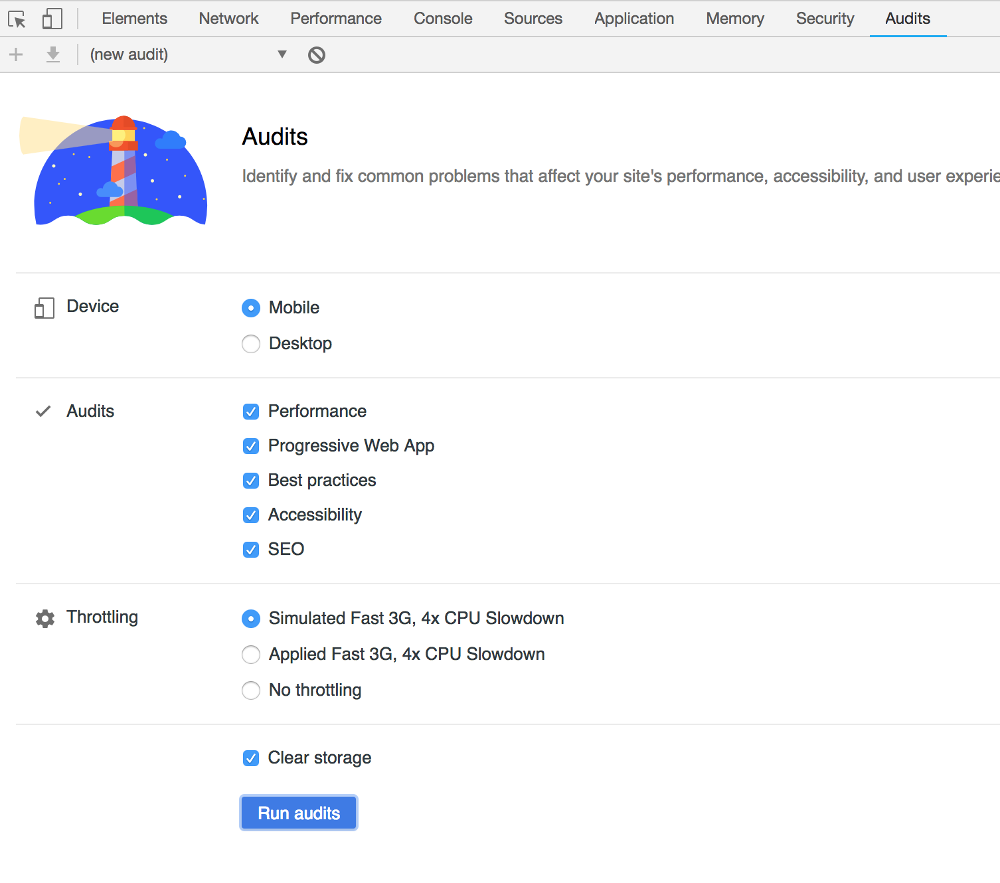
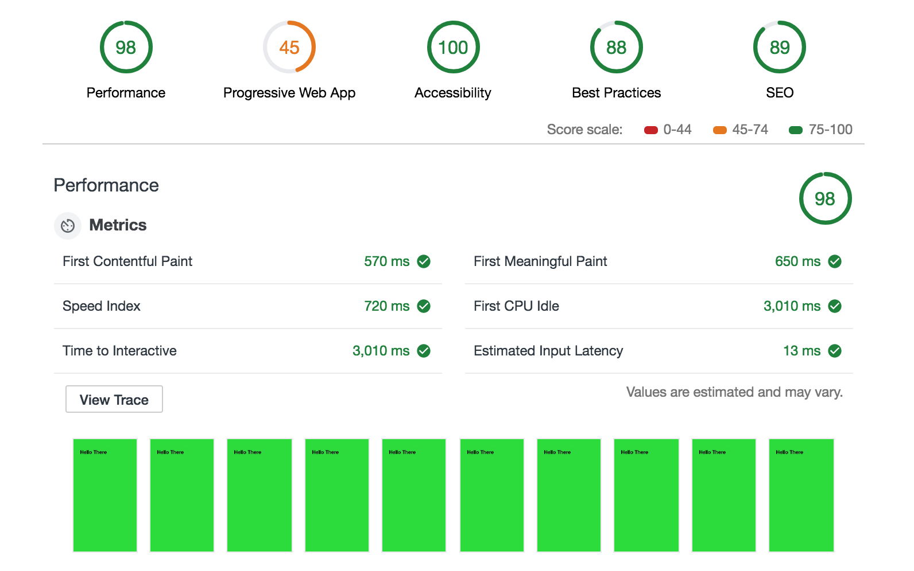
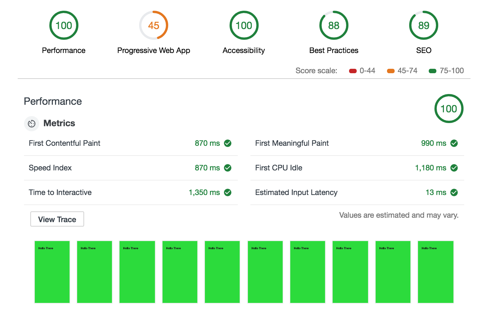
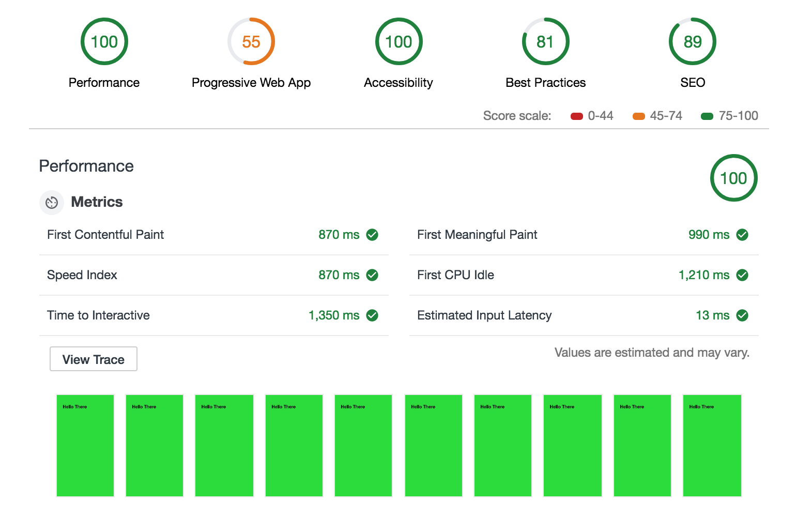

# amp-vs-pwa-vs-HTML
Simple Benchmark to check the speed of 3 different website types

## Results
All the benchmarks were run with the Lighthouse via Chrome audit tab

### AMP

### Normal html

### PWA

## Conclusions

Amp pages render fast but takes loger to become interactive. HTML and PWA (with scripts loaded asynchronously) pages using SSR will perorm almost the same