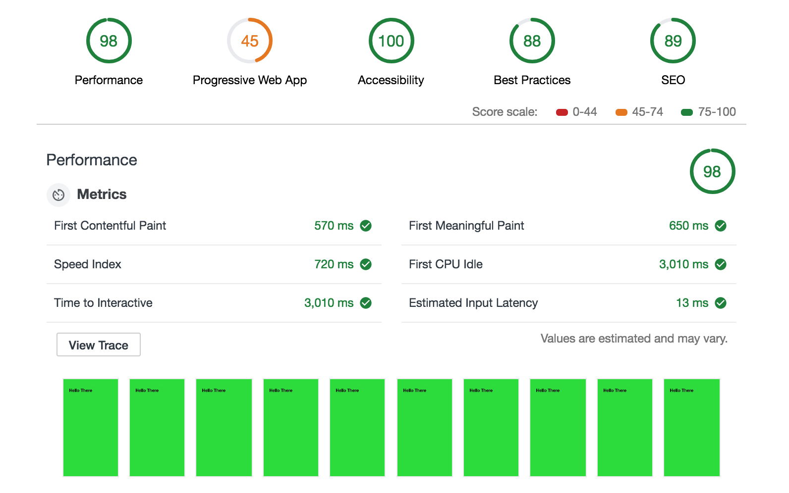
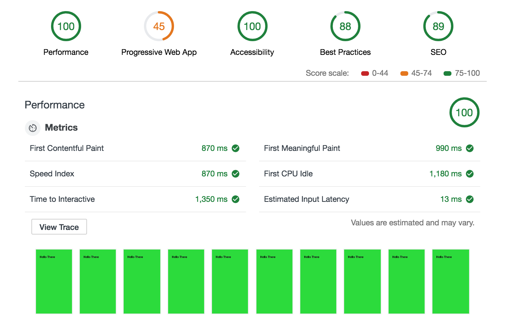
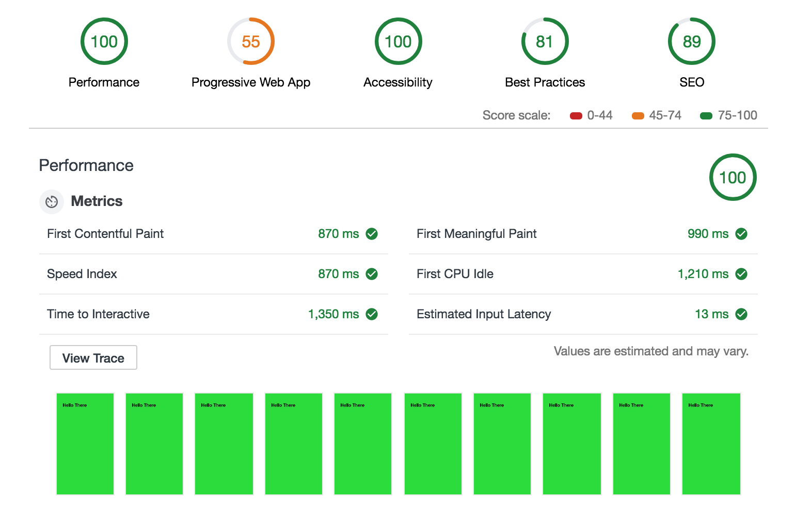
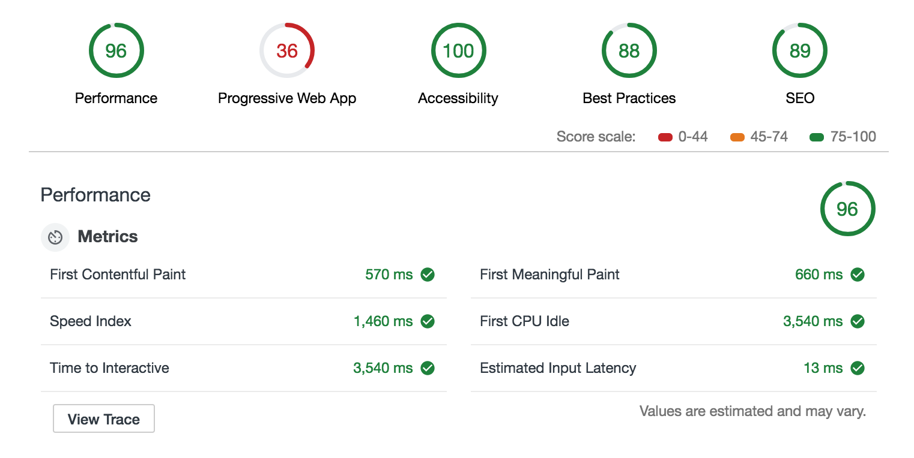
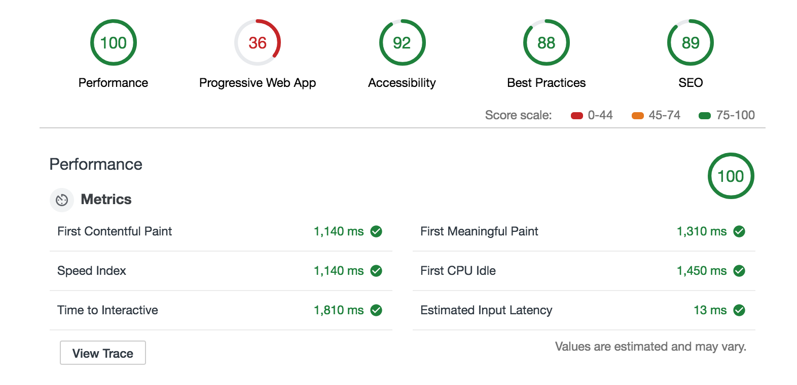
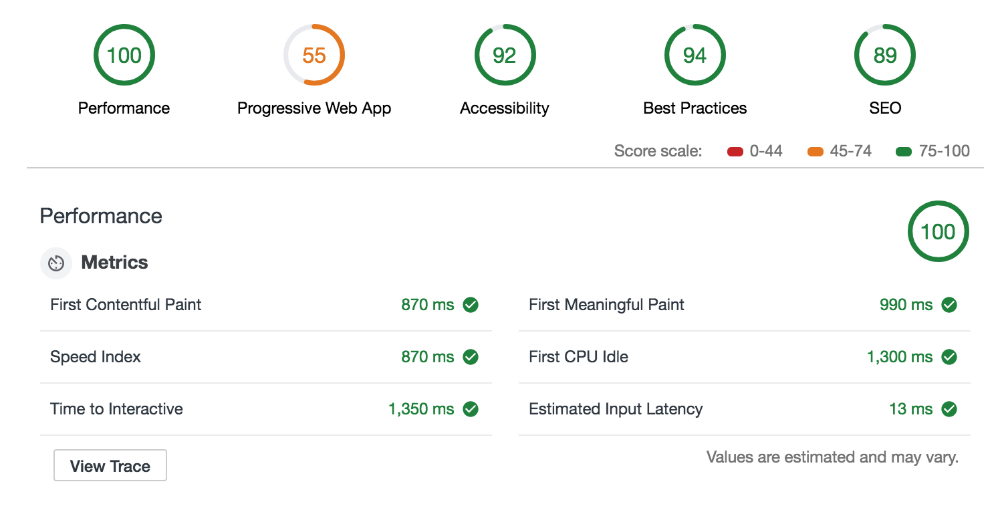

# amp-vs-pwa-vs-HTML
Simple Benchmark to check the speed of 3 different website types

## Results
All the benchmarks were run with the Lighthouse via Chrome audit tab

### Light setup
The following tests were run on simple pages containing only a `<h1>` tag with a demo text

#### AMP

#### Normal html

#### PWA

#### Conclusions for light tests

In this case Amp pages render initially fast but they take almost 3 times longer compared to the normal HTML ones to become interactive.
HTML and PWA (with scripts loaded asynchronously) sites using SSR will perform almost the same.

### Heavy setup
The following tests were run on a heavier page containing 33 images, 1 video, 1 iframe and an offcanvas menu element

#### AMP

#### Normal html

#### PWA

#### Conclusions for light tests

According to my tests AMP pages need always 3 Seconds to become interactive ([TTI](https://developers.google.com/web/tools/lighthouse/audits/time-to-interactive)). All the metrics show that they are slower than normal html and PWA ones.
I have used for the PWA demo 10 lines of javascript to load the assets lazily.
AMP pages were also not able to render my test iframe, but this [issue seems to be well documented](https://github.com/ampproject/amphtml/blob/master/spec/amp-iframe-origin-policy.md)

## Site notes

If you came here you might be interested also in checking [the-cost-of-native-javascript-modules](https://github.com/GianlucaGuarini/the-cost-of-native-javascript-modules)